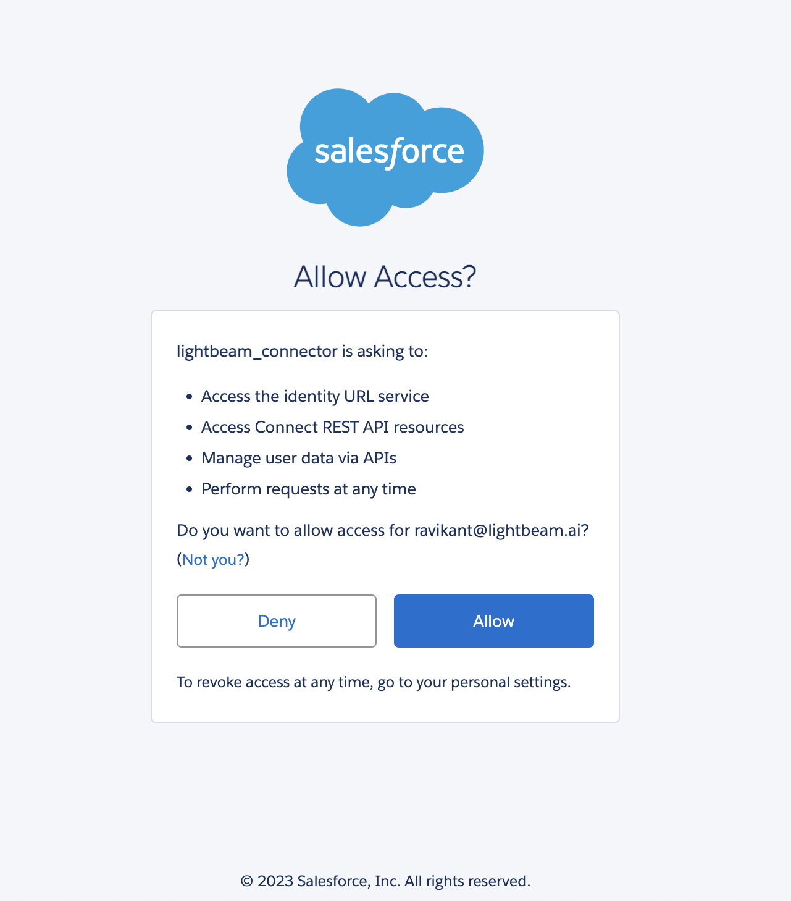

### Steps to generate the Salesforce Refresh token
#### For Unix and MacOS Operating System
1. Login to Salesforce from an account with admin access.
2. Run script `bash generate-salesforce-refresh-token.sh`
3. Enter the value of `InstanceUrl`, `Consumer Key`, `Consumer Secret` and `redirect_uri` from the connected-app details.
4. Open the printed URL in the browser and accept the connected-app permissions.
5. Copy the `code` parameter from the redirected URL and paste it in the console. If SSO URL is used then [check the note below](#note) 
6. Refresh token will be printed on the console.

#### For Windows Operating System
1. Login to Salesforce from an account with admin access.
2. Run script `generate-salesforce-refresh-token-powershell.ps1` with powershell.
3. Enter the value of `InstanceUrl`, `Consumer Key`, `Consumer Secret` and `redirect_uri` from the connected-app details.
4. Open the printed URL in the browser and accept the connected-app permissions.
5. Copy the `code` parameter from the redirected URL and paste it in the console. If SSO URL is used then [check the note below](#note)
6. Refresh token will be printed on the console.

### [Note](#note)
If the redirect URL configured in the Salesforce application is your organization's SSO URL, the code parameter will be sent to your SSO portal. To retrieve this code, quickly stop the browser immediately after opening the URL generated by the script to prevent an automatic redirect to authentication. In the developer console, you'll find a request containing the code parameter. Use this code in the script to obtain the refresh token.
