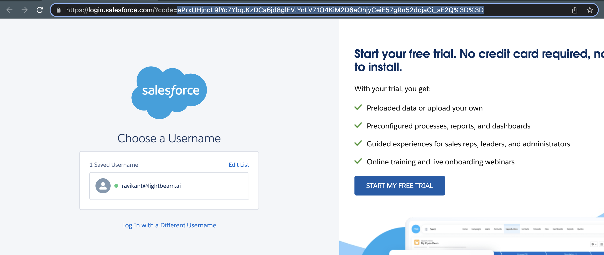

### Steps to generate the Salesforce Refresh token
#### One
1. Login to Salesforce with an account which has admin access.
2. Run script `bash generate-salesforce-refresh-token.sh`
3. Enter the `Consumer Key`, `Consumer Secret` and `redirect_uri` from the connected-app.
4. Open the printed URL in the browser and accept the connected-app permissions.
5. Copy the `code` parameter from the redirected URL and paste it in the console.
6. Refresh token will be printed on the console.